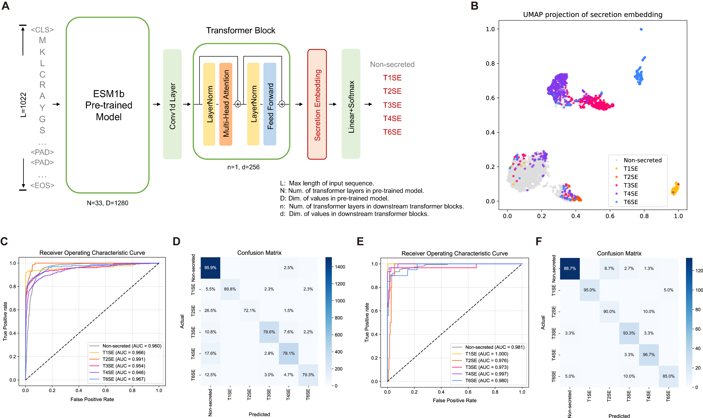

# DeepSecE

Implementation of Secretion-specific Transformer model used in secretion protein prediction in Gram-negative bacteria. DeepSecE achieves state-of-the-art performance in multi-class prediction leveraging the power of pre-trained protein language model [ESM-1b](https://github.com/facebookresearch/esm). An additional transformer layer enhances the understanding of secreted patterns. It also provides a rapid pipeline to identify type I-IV and VI secretion systems with corresponding substrate proteins.



## Performance Comparison

We choose various model architecture with different pre-trained models and training strategies, and evalute their model capacity on cross-validation and independent testing. Performance metrics are reported in the table.

| Pre-trained   Model |           Strategy           |       ACC       |                |       F1       |                |      AUPRC      |                |
| :-----------------: | :---------------------------: | :-------------: | :-------------: | :-------------: | :-------------: | :-------------: | :-------------: |
|                    |                              |      Valid      |      Test      |      Valid      |      Test      |      Valid      |      Test      |
|          /          |           PSSM+CNN           |      0.799      |      0.822      |      0.712      |      0.724      |      0.752      |      0.774      |
|      TAPEBert      |        Linear probing        |      0.816      |      0.838      |      0.764      |      0.770      |      0.802      |      0.822      |
|       ESM-1b       |        XGBoost        |      0.869      |      0.887      |      0.809      |      0.816      |      0.865      |      0.872      |
|       ESM-1b       |        Linear probing        |      0.876      |      0.870      |      0.841      |      0.810      |      0.880      |      0.871      |
|       ESM-1b       |          Fine-tuning          |      0.878      |      0.850      |      0.846      |      0.808      |      0.887      | 0.883 |
|       ESM-1b       | Secretion-specific transformer | **0.883** | **0.898** | **0.848** | **0.849** | **0.892** |      **0.885**      |

## Set up

### Requirements

- python==3.9.7
- torch==1.10.2
- biopython==1.79
- einops==0.4.1
- fair-esm>=0.4.0
- tqdm==4.64.0
- numpy==1.21.2
- scikit-learn==0.23.2
- matplotlib==3.5.1
- seaborn==0.11.0
- tensorboardX==2.0
- umap-learn==0.5.3
- warmup-scheduler==0.3.2

While we have not tested with other versions, any reasonably recent versions of these requirements should work.

### Installation

As a prerequisite, you must have PyTorch installed. It is recommended to create a new virtual environment for installation. For model training and prediction from seperate protein sequence(s), You can use this one-liner for installation.

```shell
pip install DeepSecE==0.1.0 # OR
pip install git+https://github.com/zhangyumeng1sjtu/DeepSecE.git
```

If you want to plot the sequence attention, you should install package `logomarker` first.

```shell
pip install logomaker
```

If you want to predict secretion systems and substrate proteins, you should install `macsyfinder` and `hmmer` first. Meanwhile, you need to download the TXSS profiles from [here](https://tool2-mml.sjtu.edu.cn/DeepSecE/TXSS_profiles.tar.gz), and decompress it into data directory.

```shell
pip install macsyfinder
conda install -c bioconda hmmer
cd data
wget https://tool2-mml.sjtu.edu.cn/DeepSecE/TXSS_profiles.tar.gz
tar -zxvf TXSS_profiles.tar.gz
```

The weights of DeepSecE model can be downloaded from https://tool2-mml.sjtu.edu.cn/DeepSecE/checkpoint.pt.

## Usage

### Train model

You can train the DeepSecE model by running `train.py` or `scripts/kfold_train.sh` for cross-validation.

```shell
for i in {0..4}
do
   python train.py --model effectortransformer \
		--data_dir data \
		--batch_size 32 \
		--lr 5e-5 \
		--weight_decay 4e-5 \
		--dropout_rate 0.4 \
		--num_layers 1 \
		--num_heads 4 \
		--warm_epochs 1 \
		--patience 5 \
		--lr_scheduler cosine \
		--lr_decay_steps 30 \
		--kfold 5 \
		--fold_num $i \
		--log_dir runs/attempt_cv
done
```

 Parameters:

- `--model` train a transformer or finetune a ESM-1b model.
- `--data_dir` directory that stores training data (default: ./data).
- `--num_layers` numbers of trainable transformer layer. (default: 1)
- `--num_heads` numbers of attention heads in secretion-specific transformer (default: 4).
- `--patience` patience for early stopping used in training.
- `--lr_schedular` learning rate schedular [step, consine].
- `--log_dir` directory that stores training outputs (default: logs).

### Prediction

You can predict your interested type of secreted proteins only or predict secretion systems and corresponding substrate proteins from scratch.

#### Predict secretion protein

```shell
python predict.py --fasta_path examples/Test.fasta \
		--model_location [path to model weights] \
		--secretion_systems [I II III IV VI] \
		--out_dir examples [--save_attn --no_cuda]
```

Parameters:

- `--fasta_path` path to the input protein FASTA file.
- `--model_location` path to the model weights (download from [here](https://tool2-mml.sjtu.edu.cn/DeepSecE/checkpoint.pt)).
- `--secretion_systems` type(s) of secretion system to predict (default: I II III IV VI).
- `--out_dir` directory that stores prediction outputs.
- `--save_attn` add to save sequence attention of secreted protein.
- `--no_cuda` add when CUDA is not available.

#### Predict secretion system and substrate protein

**Note:** Make sure the input file is **ordered protein sequences coded in a bacterial genome**.

```shell
python predict_genome.py --fasta_path examples/NC_002516.2_protein.fasta \
			--model_location [path to model weights] \
			--data_dir data \
			--out_dir examples/NC_002516.2 [--save_attn --no_cuda]
```

Parameters:

- `--fasta_path` path to the input protein FASTA file.
- `--model_location` path to the model weights (download from [here](https://tool2-mml.sjtu.edu.cn/DeepSecE/checkpoint.pt)).
- `--data_dir` directory that stores TXSS profiles (download from [here](https://tool2-mml.sjtu.edu.cn/DeepSecE/TXSS_profiles.tar.gz)).
- `--out_dir` directory that stores prediction outputs.
- `--save_attn` add to save sequence attention of secreted protein.
- `--no_cuda` add when CUDA is not available.

It takes about 5 minutes to predict secreted proteins from a bacterial genome containing 3000 proteion coding sequences on a NVIDIA GeForce RTX 2080 Super GPU.

### Plot attention

If you save the attention output of the putative secreted proteins (add `--save_attn`), you can run `python scripts/plot_attention.py [directory of prediction output]` to plot the saliency map from attention, and infer potentially import regions related to protein secretion.

## Contact

Please contact Yumeng Zhang at [zhangyumeng1@sjtu.edu.cn](mailto:zhangyumeng1@sjtu.edu.cn) for questions.
